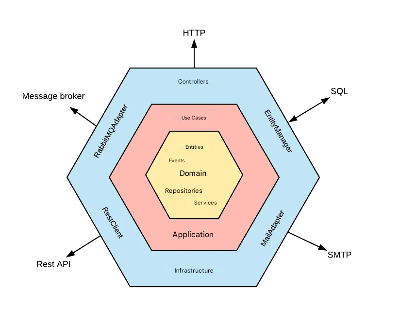

# ImageBoard

## 🏁 Introdución
Testing de concepto en PHP, la idea base es recrear un ImageBoard (4chan.org, 8kun.jp y etc)

## 📚 Elementos
Un image board es una Web donde se puede subir(de forma anonima) **imagen** con un comentarios y los demas puedes participar de la publicacion con mas **image** y comentarios..

Basicamente es un tablon de imagenes.

Asi que la pagina se queda dividida en tablon tematico (board), hilos (thread) y publicacion (post)

Los board sirve para agrupar hilos de una misma tematica [Anime,Games..]
Los thread sirve para agrupar publicaciones de deun mismo hilo 
Los post sirve para almacenar la informacion de la publicacion siendo el primer el que genera el hilo

## 💻 Tecnologías Utilizadas
- **Lenguaje de Programación**: PHP8, HTML5, CSS3 y JS
- **Base Datos**: MySQL
- **Servidor**: PHP8 (en linea de comandos)


## ⚙️ Configuración del Proyecto

En la carpeta ```migration``` tienes un dump de las tablas, la base de datos se llama **imageborad**
Para arrancar los servicios WEBs
```bash
#API
php -S localhost:4321 index.php
#Web
php -S localhost:8001 -t.\Infrastructure\View\ 
```

### 🧶Organizacion de carpetas

```
📂/API/
│
├── 📂/Application/ (Los Casos de Usos)
│
├── 📂/Domain/
│   ├── 📂/Entities/ (Las Entidades)
│   └── 📂/Repositories/ (Acceso a Base de datos CRUD)
│
├── 📂/Infrastructure/ (Toda la comunicacion con el Exterior)
│   ├── 📂/Controlles/ (Los controladores Rest-API)
│   ├── 📂/Views/ (los UI de usuario)
│   └── 📂/Services/ (El nucleo del RestAPI, con funciones que hace que todo se sostenga como autoload())
│        ├── 📄config.php
│        ├── 📄database.php
│        ├── 📄functions.php
│        ├── 📄core.php
│        └── 📄auth.php (*proximamanete)
│
├── 📂/migration/ (dump de la Base de dato y demas funcione sql)
│
├── 📄appsettings.json (fichero con definiciones de constantes)
│
└── 📄index.php
```

